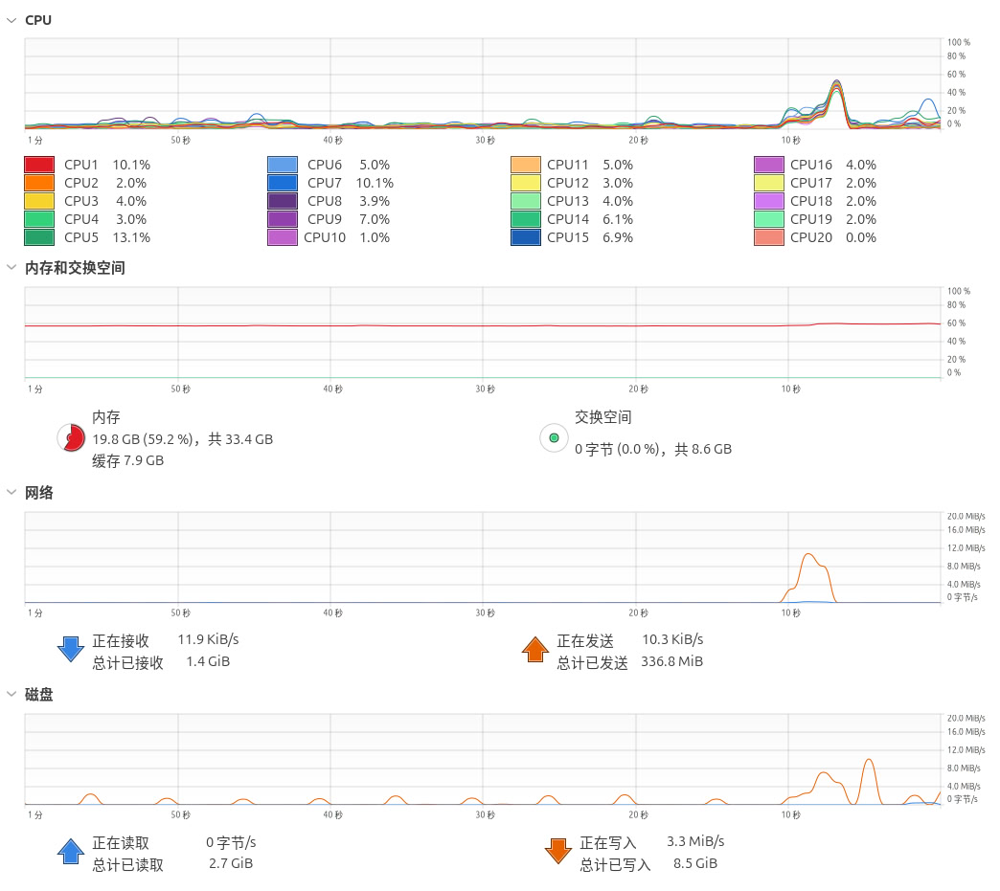
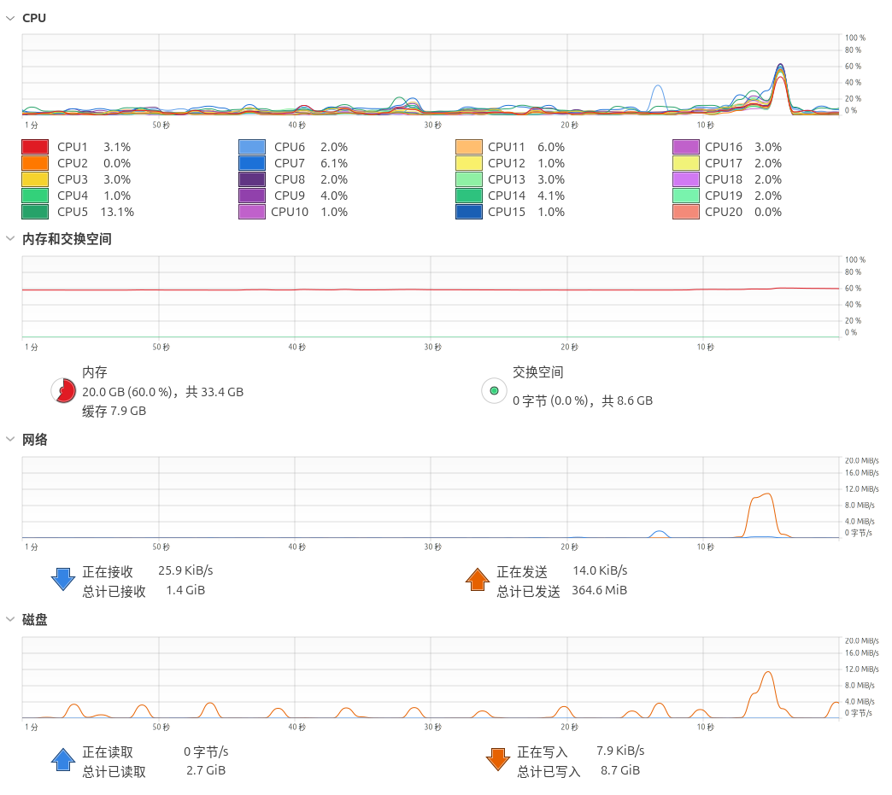
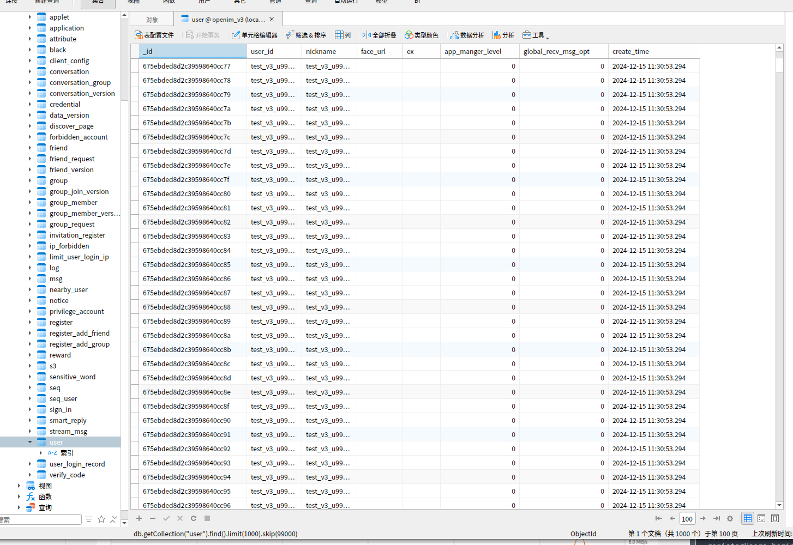
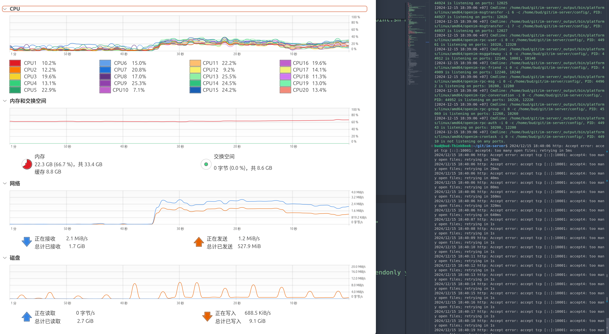
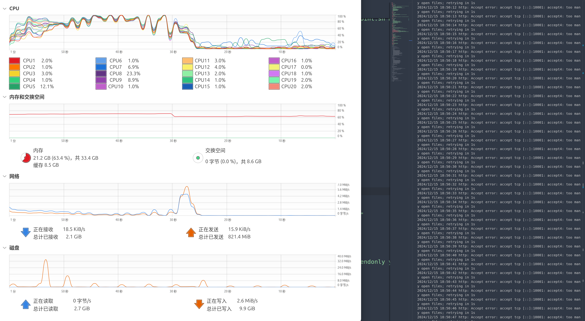
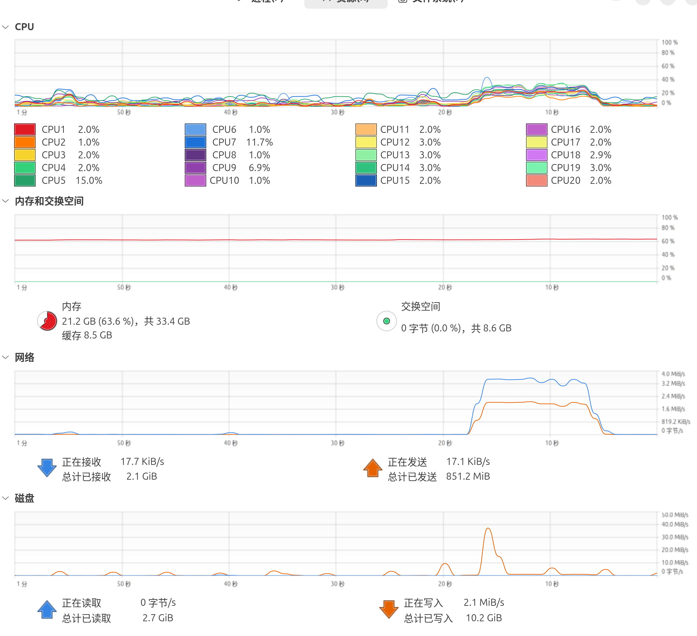

## 注册

integration_test$ go run main.go -reg -u 100000

integration_test$ go run main.go -reg -u 1000000

数据库用户表

启动5万在线用户

msgtest/main$ go run main.go -o 50000 -u true

时间坚持2分钟以上,CPU会有突高

五千个用户基本没有问题

msgtest/main$ go run main.go -o 5000 -u true

